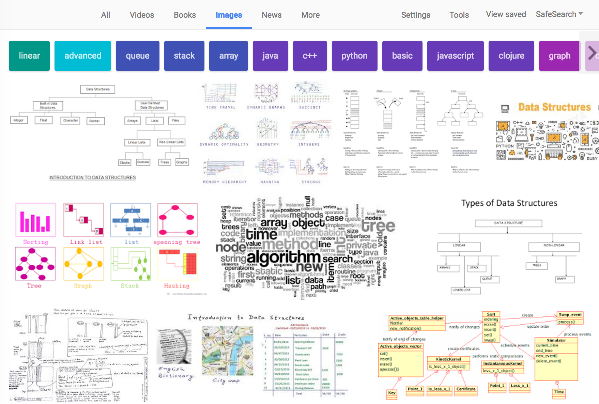

9-4-17

I'm working through this CSCI 151 Data Structures syllabus posted on Oberlin College Computer Science department page.

My goal is to learn how these data structures work and how/when they can be used.

##Data Structures
* ArrayLists
* Linked Structures, especially singly and doubly linked lists
* Stacks
* Queues
* Binary search trees
* AVL trees
* Heaps and priority queues
* Hashing, hash tables, and hash maps
* Tries
* Graphs

##Algorithms
* Big-Oh notation (upper bounds and lower bounds)
* Algorithm analysis
* BubbleSort, SelectionSort, InsertionSort
* MergeSort, QuickSort, HeapSort
* Insert, Search, and Remove algorithms for each data structure
* Shortest path algorithms for a directed graph
* Topological Sort for a directed graph
* Minimum Spanning Tree for an undirected graph
* Disjoint sets

I know there are many ways to practice computer science fundamentals online (LeetCode, HackerRank, Cracking the Coding Interview)-- but I figured that in addition to daily exercises, it would be helpful for me to learn data structure fundamentals in a purposefully structured format.

This would also be a good opportunity to learn Java where the coursework specifically assumes prior experience with Python programming.